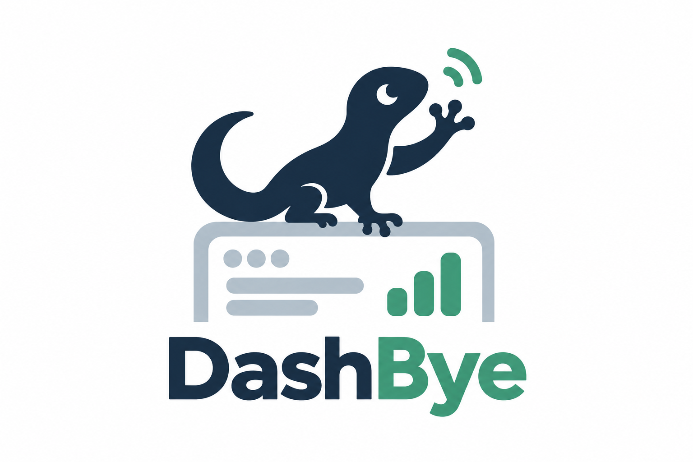

# DashBye

[English](README.md) · [简体中文](README.zh-CN.md)

*Less dashboard. More shipping.*



DashBye is a CLI that runs entirely on your computer to prepare Chrome Web Store
drafts from versioned files in your extension repository. It manages the package, store copy, screenshots,
promotional artwork, and privacy declarations.

Keep new artwork from being left behind in the Dashboard, catch permission
explanations that no longer match the built extension, and review store changes
alongside code. DashBye compares local intent with the draft, applies an approved
plan, then saves and reads it back. **It stops at Save draft; you submit and publish.**

## Your resources stay under your control

- **Local files, direct to your store draft.** DashBye reads resources from your
  chosen local directory and uploads approved changes through your local Chrome
  directly to Google's Chrome Web Store Dashboard. DashBye is a local-only CLI:
  it has no servers and does not host your resources.
- **No DashBye account or telemetry.** Configuration, plans and release locks stay
  on your computer. DashBye has no backend, analytics or resource-sync service;
  it neither publishes your resources nor pushes them to Git.
- **Your browser keeps the login session.** You sign in to Google yourself in a
  dedicated local Chrome profile. DashBye does not export cookies or store your
  password in project files.

Local validation needs no Dashboard connection; reading or saving a draft connects
to Google. If you use an external AI agent, its handling of files and conversation
content is governed separately by that agent's permissions and data policies.

## 1. Install

Requires **Node.js 22+**, Git, and official Chrome for Dashboard access.

### In a terminal

```bash
npm install --global dashbye
dashbye -h
```

Then open the extension repository and run the command-line setup wizard:

```bash
cd /path/to/extension
dashbye init
```

The terminal wizard is the default setup experience. It collects each required
value, shows the resulting configuration, and asks before writing project files.

<details>
<summary>Alternative: build from source without a global installation</summary>

```bash
git clone https://github.com/HiAriesZhou/DashBye.git
cd DashBye
npm ci
node dist/src/cli.js -h
```

`npm ci` builds the CLI through its prepare script. For subsequent commands,
replace `dashbye` with `node /absolute/path/to/DashBye/dist/src/cli.js`.

</details>

### With an agent

Open your extension repository in a coding agent with file and terminal access.
Expand and paste this prompt:

<details>
<summary>Copy the installation and setup prompt</summary>

```text
Install and configure DashBye for the extension repository in this session.
Source: https://github.com/HiAriesZhou/DashBye

1. Read AGENTS.md, inspect git status, and preserve unrelated changes. Check
   Node.js 22+ and Git. Install without sudo:
   npm install --global dashbye
   If unavailable, clone outside this extension repository, run npm ci, and use
   node /absolute/path/to/DashBye/dist/src/cli.js in place of dashbye.
2. Read dashbye -h and docs/store-schema.md from the source repository. Run:
   dashbye init --agent --json --project <absolute extension repository path>
   Supply known values as flags. For needs_input, ask one concise chat question.
   Map itemId to --item-id; the other input fields use --project, --artifact,
   --resources, --language and --endpoint. Repeat with accumulated flags.
3. For existing_config, recommend reuse; reconfigure only if I choose it.
   For ready, show the preview and execute writeCommand as an argument array
   after my confirmation. With the local CLI fallback, replace its executable.
4. Audit the actual build and existing store resources. Keep the complete desired
   listing, artwork and privacy state in this extension's configured resource
   directory. Never invent permissions, collection claims or certifications.
   Run validate; templates are placeholders, not release-ready declarations.
5. Before Dashboard access, ask me to start a dedicated Chrome profile and sign
   in manually. Keep the profile and diagnostic output outside repositories.
   Run inspect and plan. Show the target and all proposed changes and wait for
   my explicit approval before sync-draft.
6. Require a successful read-back with no remaining operations. Never submit for
   review or publish. Report changes, validation and unresolved issues.
```

</details>

Agents use the same local CLI and project files. `init --agent --json` is a
text-based automation interface for agents that cannot answer an interactive
terminal prompt; it does not require or provide graphical controls. Without local
file and terminal access, a chat session can guide setup but cannot perform it.

## 2. Configure your extension

```bash
cd /path/to/extension
dashbye init
```

The wizard asks for the project, artifact, resource directory (default: `store`),
item ID, language, and dedicated Chrome endpoint. Review the preview before saving.
Existing configuration can be reused or explicitly reconfigured.

```text
extension/
  dashbye.config.yml       # paths and Dashboard target
  store/
    release.yml           # complete listing and privacy state
    listing/              # description text
    assets/               # icon, screenshots and promo images
    releases/             # locks created after verified syncs
```

Fill the generated templates with real resources and declarations, then run
`dashbye validate`. Initialization alone does not produce a publishable release.
See [resource schema](docs/store-schema.md) for fields and image requirements.

Setup is normally once per project. Later runs find the nearest
`dashbye.config.yml`; explicit CLI flags override it. Update the configured
resources for each release. Empty lists and `null` can request remote removals.

## 3. Connect Chrome

Create a dedicated local Chrome profile for Dashboard access. A profile is Chrome's
folder for settings and login state, not a DashBye cloud account. Give it its own
folder outside the project repository so login files cannot be accidentally
committed to Git and your everyday browser session stays separate. The macOS
example below uses a local application-data folder.

Sign in manually. DashBye reuses an existing target edit tab or opens the
Dashboard in this dedicated session and navigates by the exact configured item
ID. If the login has expired, it stops for manual authentication. Multiple edit
tabs for the same item are rejected to avoid conflicting page state.

<details>
<summary>macOS launch command</summary>

```bash
"/Applications/Google Chrome.app/Contents/MacOS/Google Chrome" \
  --user-data-dir="$HOME/Library/Application Support/DashBye/chrome-profile" \
  --remote-debugging-address=127.0.0.1 \
  --remote-debugging-port=9333 \
  https://chromewebstore.google.com/devconsole
```

</details>

On other operating systems, use the same flags with the Chrome executable and a
dedicated profile path. DashBye connects to the configured loopback endpoint; it
does not control your daily Chrome, automate login or export cookies. It does not
launch Chrome automatically.
Headless session reuse remains unverified.

## 4. Review and save the draft

Keep diagnostic files outside the repository. In this example,
`/path/to/private-output` is an existing private directory.

```bash
dashbye validate
dashbye doctor --json
dashbye inspect --output /path/to/private-output/current-draft.json
dashbye plan --output /path/to/private-output/draft-plan.json
```

Review the exact target and proposed changes. After approving them:

```bash
dashbye sync-draft \
  --plan /path/to/private-output/draft-plan.json \
  --approve-plan <approvalHash-from-the-reviewed-plan> \
  --non-interactive
```

If the artifact, resources or remote state changes, regenerate and review the plan.
A successful sync saves the draft, reads it back and writes a version lock only
when no differences remain. Submit for review yourself in the Dashboard.

## Status and documentation

Early technical release. Package upload, artwork replacement, selected privacy
text changes, draft saving and read-back have been exercised on a real Dashboard.
Multiple locales, headless reuse, data-category/certification changes and new
permission confirmations remain unverified.

[Complete CLI help](#1-install): `dashbye -h` ·
[Schema](docs/store-schema.md) · [Validation record](docs/validation.md) ·
[Architecture](docs/architecture.md) · [Security](docs/security.md)

## License and brand

Code is licensed under **GPL-3.0-only**; see [LICENSE](LICENSE) and
[licensing scope](LICENSING.md). Distributed modifications must comply with GPLv3,
including its source-availability requirements. Commercial use is permitted.

The DashBye name, logo, mascot and separate visual brand assets are not granted
under the code license. Forks marketed as another product must use their own
identity; see [brand policy](TRADEMARK.md) and [asset terms](brand/LICENSE).
These terms do not restrict GPL rights in the code or claim ownership of general
product ideas. Earlier MIT releases retain their original permissions.
