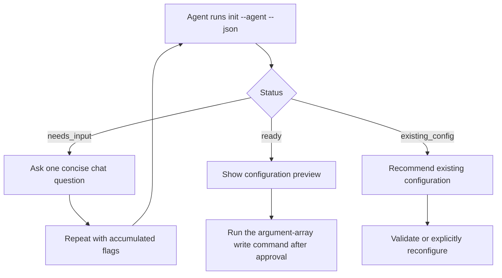

# Technical validation status

Validated on a real Chrome Web Store item with a manually authenticated, dedicated
official Chrome profile and loopback CDP connection.

## Confirmed

- Local ZIP and manifest normalization, permission comparison, listing asset checks,
  deterministic plans, stale-plan guards, and output redaction.
- Read-only package, listing, image, URL, data-use, and privacy declaration reads.
- Full desired-state comparison across package, listing, images, and privacy.
- Icon, screenshot, small promotional tile, and marquee promotional tile
  replacement, draft save, reload, and visual read-back.
- Package ZIP upload from an approved version-bound plan and read-back of the new
  draft package version.
- Single-purpose, permission-justification, and host-permission privacy-copy writes
  from an approved plan, followed by a zero-operation read-back.
- Existing authenticated session use without controlling the user's daily Chrome.
- Automatic navigation from an authenticated Dashboard tab to the exact configured
  item, without requiring the user to find or open the item editor first.
- Agent initialization as a multi-turn JSON protocol: `needs_input` questions for
  artifact, resource root, item ID, language, and endpoint; a `ready` preview with
  an argument-array write command; and `existing_config` detection after writing.

## Agent CLI behavior

Tested in Codex Desktop on 2026-09-22. The CLI returned structured questions and
choices correctly, and the agent completed initialization through ordinary chat
and local command execution. DashBye treats this as a text-based CLI protocol and
does not require a GUI-specific menu or input control.

The environment did not have a global `dashbye` executable. Replacing the executable
in the returned `writeCommand` with the local `node dist/src/cli.js` entry point
succeeded, created the ignored test configuration, and produced `existing_config`
on the next run.

## Failed and fixed

- Waiting for a native `filechooser` event timed out because **Upload new package**
  opens an in-page upload dialog. The adapter now targets that dialog's ZIP/CRX file
  input and verifies the resulting draft version.
- The original 8×8 grayscale average hash treated visually similar old and new store
  artwork as equal. Asset comparison now uses a 16×16 RGB signature with a measured
  thumbnail-encoding tolerance. Regression tests distinguish resizing from material
  artwork changes, and public inspect output exposes only hashes of these signatures.
- Dashboard image removal opens a confirmation dialog. The adapter now confirms
  each planned removal, waits for the replacement preview to finish loading, and
  requires the Save draft state to remain settled before read-back.
- The Dashboard's current English selector uses the full
  `English – en (default)` label, while the adapter expected `English`. Selection now
  prefers the configured full label and keeps the short label only as a fallback.
- The Dashboard may retain duplicate hidden component trees. Reads and writes now
  target visible controls, and screenshot previews are de-duplicated by their
  rendered position rather than by image content.

## Not yet validated

- Reusing a manually authenticated profile in a newly launched headless process.
  The supported path remains a visible dedicated Chrome connected over loopback CDP.
- A collected-data change, certification change, or new permission confirmation.
  These remain plan-bound and owner-approved operations.
- Multiple locales and Dashboard languages other than English.
- Review submission and publication. They are intentionally outside DashBye.
